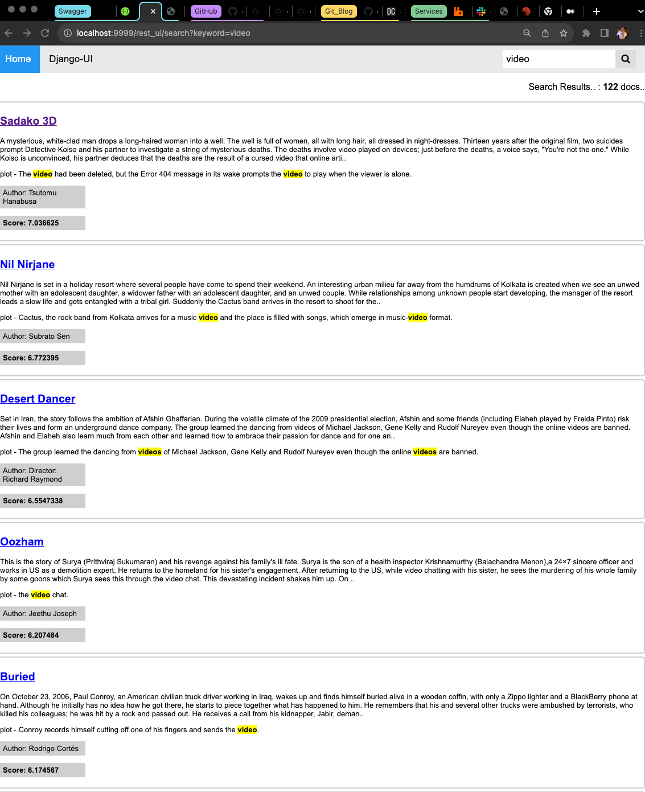
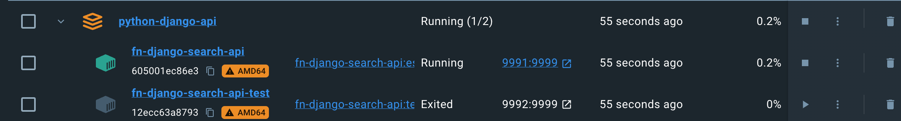

### Python-Search Project with Django


__Why Django REST Framework?__
There are many frameworks for building REST APIs, but we’re gonna use the Django Rest Framework by the following reasons:
- The Web browsable API is a huge usability win for developers.
- Authentication policies including packages for OAuth1a and OAuth2.
- Serialization supports both ORM and non-ORM data sources.
- Customizable all the way down – just use regular function-based views if you don’t need the more powerful features.
- Extensive documentation, and great community support.
- Used and trusted by internationally recognised companies including Mozilla, Red Hat, Heroku, and Eventbrite.


Guide
```
https://www.django-rest-framework.org/
https://cntechsystems.tistory.com/66
https://velog.io/@zueon/DRF-%EA%B8%B0%EC%B4%88
# --
# Swagger
https://episyche.com/blog/how-to-create-django-api-documentation-using-swagger
https://pjs21s.github.io/vuejs-restframe/
```


Install Poerty
```
https://python-poetry.org/docs/?ref=dylancastillo.co#installing-with-the-official-installer
```

Using Poetry: Create the virtual environment in the same directory as the project and install the dependencies:
```bash
django-admin startproject python-django
poetry config virtualenvs.in-project true
poetry init
```


Create virtualenv
```bash
python -m venv .venv
source .venv/bin/activate
```


Poetry install
```bash
poetry install
poetry add djangorestframework
# For Swqgger
poetry add django-rest-swagger
poetry add drf-yasg
poetry add django-cors-headers
poetry add django-prometheus
poetry add pytest-django
```

Add 'rest_framework' to your INSTALLED_APPS setting.
```bash
INSTALLED_APPS = [
    ...
    # --
    # Django Prometheus
    "django_prometheus",
    # --
    'rest_framework',
    # --
    # Add Swagger
    'rest_framework_swagger',
    'drf_yasg',
    # --
    "rest_api",
    'book_rest_api'		 
]
```

Create project
```bash
source .venv/bin/activate
poetry run python manage.py migrate 
# Create rest_api app
python manage.py startapp rest_api
# Create book rest_api app
python manage.py startapp book_rest_api
```

Run server
```bash
python manage.py runserver 9999
```

Django Admin Page (http://localhost:9999/admin)
```bash
python manage.py migrate

(.venv) ➜  python-django git:(master) ✗ python manage.py createsuperuser
System check identified some issues:

WARNINGS:
?: (urls.W005) URL namespace 'admin' isn't unique. You may not be able to reverse all URLs in this namespace
Username (leave blank to use 'euiyoung.hwang'): admin
Email address: marieuig@gmail.com
Password: 
Password (again): 
This password is too short. It must contain at least 8 characters.
This password is too common.
This password is entirely numeric.
Bypass password validation and create user anyway? [y/N]: y
Superuser created successfully.
```

Add Model
```bash
# models.py
# -- Record & detect about the changing for the model
python manage.py makemigrations
# -- Update to DB if any changes in the model (this step requires in the Django)
python manage.py migrate

(.venv) ➜  python-django git:(master) ✗ python manage.py makemigrations
Migrations for 'rest_api':
  rest_api/migrations/0001_initial.py
    - Create model Student
    - Create model userRank
```
- To use multiple databases you have to tell Django about the database server you will be using, but adding them in the settings.py.
- The migrate management command operates on one database at a time. By default, it operates on the default database, but by providing the --database option, you can tell it to synchronize a different database.
```bash
$ ./manage.py migrate --database=users
$ ./manage.py migrate --database=customers
```
- Turned out that migrate command accepts database CLI parameter, which by default is set to default , so it’s easy to run migrations on another database:
```bash
# file: models.py

class Author(Model):
    first_name = models.TextField()
    last_name = models.TextField()

class Book(Model):
    content = models.TextField()


# file: settings.py
DATABASES = {
    "default": {
        "ENGINE": "django.db.backends.sqlite3",
        "NAME": BASE_DIR / "db.sqlite3",
    },
    "books": {
        "ENGINE": "django.db.backends.sqlite3",
        "NAME": BASE_DIR / "books.sqlite3",
    }
}

python manage.py migrate --database=books
```
- You can manually select the database in your queries queries e.g or create dbrouters.py # [new file], we will be creating soon. <i>https://stackoverflow.com/questions/57676143/using-multiple-databases-with-django</i>
```bash
user = User(....)
user.save(using='users')
Customer.objects.all().using('users')
```

URL
```http
# Django
http://localhost:9999/

# Django UI
http://localhost:9999/rest_ui/

# djangorestframework (DRF) <- Instead of djangorestframework, build Swagger from config.urls (This above url's not working )
http://localhost:9999/rest_api/swagger/

# djangorestframework (DRF) &&  rest_framework_swagger, drf_yasg
http://localhost:9999/swagger/
http://localhost:9999/redoc/

# Prometheus
https://hodovi.cc/blog/django-monitoring-with-prometheus-and-grafana/
http://localhost:9999/rest_api/prometheus/metrics
```

Django search (Frontend)
- http://localhost:9999/rest_ui/
- view in rest_ui app is calling to rest_api (POST: /es/search) for searching from elasticsearch in rest_api app in Django project


- It does show you to retrieve texts using Django template in rest_ui app in this project



Postgres
```bash
# To be able to use PostgreSQL in Django we have to install a package called psycopg2.
poetry add psycopg2-binary

# Add this setting in settings.py
DATABASES = {
    'default': {
        'ENGINE': 'django.db.backends.postgresql',
        'NAME': 'project',
        'USER': 'root',
        'PASSWORD': 'password',
        'HOST': 'localhost',
        'PORT': '',
    }
}
```

Gunicorn Serive Rigistry
```bash
sudo vi /etc/systemd/system/django-gunicorn.service

[Unit]
Description=gunicorn daemon
After=network.target

#--
[Service]
User=foo
Group=www-data
WorkingDirectory=/home/foo/django_test/repo
ExecStart=/Users/euiyoung.hwang/ES/Python_Workspace/python-django/.venv/bin/gunicorn \
        --workers 3 \
        --bind 0.0.0.0:9999 \
        config.wsgi:application

[Install]
WantedBy=multi-user.target
#--

# Run service
systemctl daemon-reload
# Autostart when rebooting
sudo systemctl enable django-gunicorn.service
systemctl start django-gunicorn

systemctl status django-gunicorn.service
● django-gunicorn.service - 
```

Docker Build & Run/Pytest : Docker build for running service & pytest through docker-compose.yml





Pytest (<i>poetry run pytest -v rest_api/tests</i>)
- [pytest] DJANGO_SETTINGS_MODULE = config.settings_dev for Dev Environment
- poetry run pytest -v rest_api/tests --junitxml=test-reports/junit/pytest.xml --cov-report html --cov

```bash
platform darwin -- Python 3.9.7, pytest-7.4.3, pluggy-1.3.0 -- /Users/euiyoung.hwang/ES/Python_Workspace/python-django/.venv/bin/python
cachedir: .pytest_cache
django: settings: config.settings_dev (from ini)
rootdir: /Users/euiyoung.hwang/ES/Python_Workspace/python-django/rest_api/tests
configfile: pytest.ini
plugins: cov-4.1.0, django-4.5.2
collected 12 items                                                                                                                         

rest_api/tests/test_build_query.py::test_build_skip SKIPPED (no way of currently testing this)                                       [  8%]
rest_api/tests/test_build_query.py::test_build_terms[_term0] PASSED                                                                  [ 16%]
rest_api/tests/test_build_query.py::test_build_terms_batch PASSED                                                                    [ 25%]
rest_api/tests/test_elasticsearch.py::test_search_skip SKIPPED (no way of currently testing this)                                    [ 33%]
rest_api/tests/test_elasticsearch.py::test_elasticsearch PASSED                                                                      [ 41%]
rest_api/tests/test_elasticsearch.py::test_indics_analyzer_elasticsearch PASSED                                                      [ 50%]
rest_api/tests/test_rest_api.py::test_api_skip SKIPPED (no way of currently testing this)                                            [ 58%]
rest_api/tests/test_rest_api.py::test_api_test_swagger PASSED                                                                        [ 66%]
rest_api/tests/test_rest_api.py::test_api_users_swagger[1] PASSED                                                                    [ 75%]
rest_api/tests/test_rest_api.py::test_api_users_swagger[2] PASSED                                                                    [ 83%]
rest_api/tests/test_rest_api.py::test_api_users_swagger[3] PASSED                                                                    [ 91%]
rest_api/tests/test_rest_api.py::test_api_es_search_swagger PASSED                                                                   [100%]
```

HTTP Response status codes (<i>https://developer.mozilla.org/en-US/docs/Web/HTTP/Status/204</i>)
```http
100 Continue
101 Switching Protocols
102 Processing
103 Early Hints
Experimental
200 OK
201 Created
202 Accepted
203 Non-Authoritative Information
204 No Content
205 Reset Content
206 Partial Content
207 Multi-Status
208 Already Reported
226 IM Used
300 Multiple Choices
301 Moved Permanently
302 Found
303 See Other
304 Not Modified
307 Temporary Redirect
308 Permanent Redirect
400 Bad Request
401 Unauthorized
402 Payment Required
403 Forbidden
404 Not Found
405 Method Not Allowed
406 Not Acceptable
407 Proxy Authentication Required
408 Request Timeout
409 Conflict
410 Gone
411 Length Required
412 Precondition Failed
413 Content Too Large
414 URI Too Long
415 Unsupported Media Type
416 Range Not Satisfiable
417 Expectation Failed
418 I'm a teapot
421 Misdirected Request
422 Unprocessable Content
423 Locked
424 Failed Dependency
425 Too Early
426 Upgrade Required
428 Precondition Required
429 Too Many Requests
431 Request Header Fields Too Large
451 Unavailable For Legal Reasons
500 Internal Server Error
501 Not Implemented
502 Bad Gateway
503 Service Unavailable
504 Gateway Timeout
505 HTTP Version Not Supported
506 Variant Also Negotiates
507 Insufficient Storage
508 Loop Detected
510 Not Extended
511 Network Authentication Required
```

#### Example for Crontab
- All Linux distributions are equipped with the cron utility, which allows users to schedule jobs to run at certain fixed times.
- The system-wide root cron jobs are located in the /etc/crontab file. The file contents can be displayed using any text editor, or utilities like cat and more. sudo is not required to display the system cron jobs.
```bash
# Example of job definition:
# .---------------- minute (0 - 59)
# |  .------------- hour (0 - 23)
# |  |  .---------- day of month (1 - 31)
# |  |  |  .------- month (1 - 12) OR jan,feb,mar,apr ...
# |  |  |  |  .---- day of week (0 - 6) (Sunday=0 or 7) OR sun,mon,tue,wed,thu,fri,sat
# |  |  |  |  |
# *  *  *  *  * user-name command to be executed
17 *	* * *	root    cd / && run-parts --report /etc/cron.hourly
25 6	* * *	root	test -x /usr/sbin/anacron || ( cd / && run-parts --report /etc/cron.daily )
47 6	* * 7	root	test -x /usr/sbin/anacron || ( cd / && run-parts --report /etc/cron.weekly )
52 6	1 * *	root	test -x /usr/sbin/anacron || ( cd / && run-parts --report /etc/cron.monthly )
```